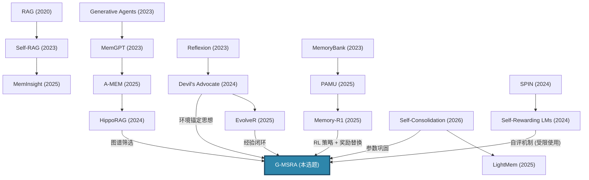

# 最终选题：Grounded Memory-Guided Self-Rewarding Agents

> **Closing the Loop: Environment-Grounded Self-Reward for Autonomous Memory Management in Lifelong LLM Agents**

> **一句话定位**：构建首个将 **RL 驱动的记忆管理**、**环境锚定的自生成奖励** 与 **自适应参数巩固** 统一为闭环的 LLM Agent 框架。Agent 在持续交互中通过环境反馈与记忆一致性的复合信号自主学习，规避纯自评的奖励作弊风险，实现真正可靠的终身自主进化。

---

## 一、选题的核心洞察：三条线的断裂

精读全部 23 篇论文后，当前研究存在三条独立发展但尚未打通的技术线：

| 技术线 | 代表作 | 解决的问题 | 遗留的断裂 |
|--------|--------|------------|------------|
| **记忆策略学习** | Memory-R1, PAMU | 用 RL 学习 ADD/UPDATE/DELETE 策略 | 奖励信号仍依赖外部标注答案（如 QA F1）——在无标签的开放场景中无法运行 |
| **自生成学习信号** | Self-Rewarding LMs, SPIN | 模型自评打分 + Iterative DPO | 完全不涉及记忆——模型无法跨会话积累经验，每次从零开始评价 |
| **参数级记忆巩固** | Self-Consolidation, LightMem | 文本经验 → LoRA 参数蒸馏 | 巩固的"原材料"只是成功/失败轨迹的文本反思，没有利用记忆管理策略积累的结构化经验 |

> **核心 Gap**：没有任何一篇论文同时解决了 "**记什么**（Memory Policy）""**学习信号从何而来**（Self-Rewarding）""**何时内化**（Consolidation Trigger）" 这三个问题。

### 1.1 更深层的矛盾：自奖励的可信度困境

在深入分析后，我们识别出第四条、也是最根本的断裂——**奖励信号的可信度**：

| 现有方案 | 奖励来源 | 致命缺陷 |
|---------|---------|---------|
| Memory-R1 | QA F1（外部标注） | 开放世界无标签，直接不可用 |
| Self-Rewarding LMs | LLM-as-Judge（纯内部） | 自我确证偏误（Self-Confirmation Bias）：模型倾向于给"自洽但错误"的回答高分，优化的是 consistency 而非 truth |
| Reflexion / EvolveR | 环境反馈（任务成功/失败） | 有 Grounding，但信号粒度太粗（仅 binary），且无法指导记忆管理的精细决策 |

> **本文的核心洞察**：单纯的内部自评会导致 Reward Hacking；单纯的外部 F1 无法泛化到开放场景。**解法不是在两者中二选一，而是设计一种以环境反馈为锚、以记忆一致性为精细化信号的混合奖励机制**。

---

## 二、选题全貌：G-MSRA — Grounded Memory-guided Self-Rewarding Agent

### 2.1 框架概览

```
┌──────────────── G-MSRA Framework ─────────────────┐
│                                                     │
│  ┌──────────────┐  ┌──────────────┐  ┌───────────┐ │
│  │  Structured   │─▶│  Grounded    │─▶│ Adaptive  │ │
│  │  Memory       │  │  Self-Reward │  │ Consolid- │ │
│  │  Manager      │  │  Generator   │  │ ator      │ │
│  │  (RL Policy)  │  │              │  │ (LoRA)    │ │
│  │              │  │  ┌─────────┐ │  │           │ │
│  │ ADD/UPDATE/  │  │  │Env.     │ │  │ Trigger:  │ │
│  │ DELETE/NOOP  │  │  │Grounding│ │  │ conflict  │ │
│  │              │  │  │(anchor) │ │  │ + variance│ │
│  │              │  │  ├─────────┤ │  │ + growth  │ │
│  │              │  │  │Memory   │ │  │           │ │
│  │              │  │  │Consist. │ │  │           │ │
│  │              │  │  │(refiner)│ │  │           │ │
│  └──────┬───────┘  │  └─────────┘ │  └─────┬─────┘ │
│         │          └──────┬───────┘        │       │
│         │    ◀── Reward ──┘                │       │
│         └────── Experience Loop ───────────┘       │
│                                                     │
│  Online: MemManager + Grounded Self-Reward          │
│  Offline (Sleep-time): Semantic LoRA Distillation   │
└─────────────────────────────────────────────────────┘
```

### 2.2 核心设计原则

我们采用 **"减法设计"** 策略：不追求最宏大的框架，而追求每个模块的不可替代性与归因清晰性。

| 设计决策 | 理由 |
|---------|------|
| 放弃图谱序列化蒸馏，改用语义三元组文本蒸馏 | 降低工程复杂度，保留图谱的筛选价值 |
| 用混合奖励替代纯自奖励 | 从根源上解决 Reward Hacking |
| 不做 DPO 自训练 | 避免 RL + DPO + LoRA 三重训练的归因混乱 |
| 分阶段课程式训练 | 确保每个阶段的增益可独立验证 |

---

### 2.3 四大模块的创新设计

#### 模块 A：环境锚定的自奖励（Environment-Grounded Self-Rewarding）

**这是本文最核心的创新，也是解决 Reward Hacking 的关键。**

**现有方法的根本矛盾**：
- Self-Rewarding LMs 让模型给自己打分 → 自我确证偏误：优化 consistency 而非 truth
- Memory-R1 的 QA F1 → 需要标注，开放场景不可用
- 反思类方法（Reflexion, EvolveR）→ 有环境信号但粒度太粗

**本文创新：双层复合奖励函数**

$$
R_{\text{total}}(t) = \underbrace{R_{\text{env}}(t)}_{\text{环境锚 (anchor)}} + \lambda \cdot \underbrace{R_{\text{mem}}(t)}_{\text{记忆一致性 (refiner)}}
$$

其中：

**第一层——环境锚定信号 $R_{\text{env}}$（防止 Reward Hacking 的核心保障）**：
- 在 Agent 任务场景（WebArena/ALFWorld）：直接获取环境反馈（任务成功/失败/部分完成）
- 在对话记忆场景（LoCoMo/LongMemEval）：利用下一轮用户的实际反应作为隐式反馈（用户是否纠正、追问、表达不满？）
- 关键属性：**不依赖人工标注，但来自外部世界**——这保证了奖励信号的 grounding，模型无法通过"自洽但错误"来骗取高分

**第二层——记忆一致性信号 $R_{\text{mem}}$（精细化引导记忆操作）**：
- 在环境锚的基础上，让 LLM-as-Judge 参考记忆库中的相关历史，评估当前记忆操作的质量
- **关键限制**：$R_{\text{mem}}$ 仅作为 $R_{\text{env}}$ 的精细化补充（$\lambda < 1$），而非独立的奖励源
- 具体机制：Agent 完成任务后，Judge 同时看到 (a) 当前回答 (b) 记忆库相关历史 (c) 环境反馈结果，生成记忆操作的质量评分

**为什么这彻底解决了 Reward Hacking**：

| 攻击场景 | 纯自奖励 (Self-Rewarding) | G-MSRA 混合奖励 |
|---------|:-:|:-:|
| 模型记住了错误事实，但逻辑自洽 | 高分 ✗ | 环境反馈纠正 ✓ |
| 记忆库累积噪声，Judge 被噪声污染 | 正反馈环 ✗ | 环境锚阻断循环 ✓ |
| 模型删除"对的但不一致"的记忆 | 内部一致性反而增高 ✗ | 环境任务表现下降 → 惩罚 ✓ |

**记忆置信度分层（防止记忆噪声污染 Judge）**：
- 为每条记忆维护置信度分数 $c_i$，基于：写入时的 $R_{\text{env}}$、被检索后任务成功次数、存活时间
- Judge 评估时，仅参考置信度 top-K 的记忆，过滤低质量记忆的干扰

$$
c_i(t) = \sigma\left(w_1 \cdot R_{\text{env}}^{\text{write}} + w_2 \cdot \frac{\text{hit\_success}_i}{\text{hit\_total}_i} + w_3 \cdot \log(1 + \text{age}_i)\right)
$$

#### 模块 B：RL 驱动的结构化记忆管理器（RL-Based Memory Manager）

基于 Memory-R1 的架构，但有两处关键改进：

1. **奖励信号替换**：从外部 QA F1 替换为上述混合奖励 $R_{\text{total}}$，使得 RL 策略可在无标注环境中持续训练
2. **动作空间保持简洁**：仅保留 ADD / UPDATE / DELETE / NOOP 四种操作（不引入额外操作增加策略空间复杂度），通过组合表达所有记忆管理行为

**记忆组织方式**：采用 A-MEM 风格的 Zettelkasten 知识卡片结构，每条记忆包含：
- 内容摘要 + 关键词 + 标签
- 指向相关记忆的显式链接（形成记忆图谱）
- 置信度分数 $c_i$
- 时间戳 + 来源标注

#### 模块 C：自适应巩固触发器（Adaptive Consolidation Trigger）

**现有方法的缺陷**：
- Self-Consolidation 用启发式阈值（每 N 条反思触发一次 LoRA）——没有理论依据
- LightMem 用 sleep-time update——但"何时 sleep"也是固定的

**本文创新**：设计基于三维信号的智能触发策略：

1. **记忆冲突度**（Memory Conflict Index）：新记忆与旧记忆在同一主题上产生语义矛盾时，冲突度升高 → 触发巩固以消解
2. **奖励波动度**（Reward Variance）：$R_{\text{total}}$ 在最近 K 个任务中方差突增，表明模型能力不稳定 → 需要巩固以稳定认知
3. **记忆库膨胀率**（Memory Growth Rate）：防止外部记忆无限增长，当增长率超过阈值时触发参数化蒸馏

$$
\text{Trigger}(t) = \mathbb{1}\left[\alpha \cdot \text{Conflict}(t) + \beta \cdot \text{Var}(R_{t-K:t}) + \gamma \cdot \text{Growth}(t) > \theta\right]
$$

#### 模块 D：语义蒸馏式参数巩固（Semantic Distillation Consolidation）

**与原方案的关键区别**：放弃图谱序列化（信息损失严重），改用更稳健的语义蒸馏路线。

**巩固流程**：
1. 从记忆图谱中提取**高频关联子图**（受 HippoRAG 启发）——图谱的价值体现在 **筛选要蒸馏什么**
2. 将子图中的高价值记忆转化为**语义三元组声明**（如 "User prefers X over Y because Z"）
3. 用这些声明作为 SFT 数据对 LoRA 层进行微调
4. 同时蒸馏**策略知识**（高频成功的 ADD/DELETE 决策模式）和**事实知识**（语义三元组中的实体关系）

**LoRA 微调配置**：
- rank=16, alpha=32, target=`q_proj, v_proj`
- 巩固后清空已蒸馏的记忆条目，控制外部记忆库的规模增长

**灾难性遗忘防护**：
- 双 LoRA 分层设计：high-rank LoRA（r=32）保留已巩固的长期知识，low-rank LoRA（r=8）用于新一轮短期适应
- 每次巩固时对 high-rank LoRA 进行 EWC（Elastic Weight Consolidation）正则化

---

## 三、训练方案：分阶段课程式训练

**核心原则：每个阶段的增益可独立验证，确保归因清晰。**

> 这是对原方案最重要的修订之一。原方案中 RL + DPO + LoRA 三重训练同时进行，会导致归因混乱、训练不稳定。新方案将训练拆为四个递进阶段，每个阶段都有明确的单一目标。

### Phase 0：SFT 热启动 (1-2 天)
- **目标**：让 Memory Manager 学会基础 CRUD 操作格式
- **方法**：用少量人工标注的记忆操作示例（~100 条）做 SFT
- **验证**：操作格式准确率 > 95%

### Phase 1：RL + 外部奖励训练 (3-5 天)
- **目标**：在有标注场景下训练稳定的 RL 策略
- **方法**：在 LoCoMo 数据集上使用 QA F1 作为奖励，PPO/GRPO 微调 Memory Manager
- **验证**：对比 Memory-R1 baseline，确认 RL 策略已收敛
- **意义**：建立性能上界，后续阶段切换到自奖励后可以对比衰减幅度

### Phase 2：自奖励切换 (5-7 天)
- **目标**：逐步用混合奖励 $R_{\text{total}}$ 替代外部标注奖励
- **方法**：线性退火 $\alpha: 1.0 \to 0.0$，即逐步增加自奖励比重：

$$
R_{\text{phase2}}(t) = \alpha(t) \cdot R_{\text{ext}} + (1 - \alpha(t)) \cdot R_{\text{total}}
$$

- **关键监控指标**：Self-Reward 校准度（Kendall τ vs 外部标注）——如果 τ < 0.5 则暂停退火
- **验证**：最终 $\alpha = 0$ 时性能相比 Phase 1 衰减 < 5%

### Phase 3：全闭环 + 巩固启动 (持续运行)
- **目标**：纯自奖励驱动 + 自适应巩固
- **方法**：停止外部奖励，启动 Trigger 机制，首次激活 LoRA 巩固
- **验证**：长期任务成功率曲线呈上升趋势；记忆库规模增长受控

---

## 四、实验方案

### 4.1 数据集与基准

| 能力维度 | 数据集 | 评测目标 | 环境信号来源 |
|----------|--------|----------|-------------|
| 长期对话记忆 | LoCoMo, LongMemEval | 信息抽取、多会话推理、时间推理、知识更新、弃答 | 下一轮用户反应 / QA F1（Phase 1 用） |
| Agent 任务演化 | WebArena, ALFWorld | 长期任务成功率曲线、失败复发率 | 环境成功/失败返回值 |
| 演化效率 | Evo-Memory | 记忆库大小 vs 任务轮数、巩固频率、token 开销 | 任务流准确率 |

### 4.2 对比基线

| 基线 | 描述 | 对应缺失 |
|------|------|---------|
| Memory-R1 | RL 记忆管理 + 外部 QA F1 奖励 | 无自奖励、无巩固 |
| Self-Consolidation | 对比反思 + LoRA 巩固 | 无 RL 管理、无自奖励 |
| EvolveR | 经验生命周期 + 策略蒸馏 | 无参数巩固、无自奖励 |
| Reflexion | 语言反思 | 无 RL、无巩固、无自奖励 |
| Mem0 + Memory-R1 | 简单拼装基线 | 无自奖励、无巩固——验证协同效应 |
| G-MSRA (Ours) | 完整框架 | — |

> **Mem0 + Memory-R1 拼装基线**是新增的关键对比项，用于回答审稿人最可能的问题：G-MSRA 的增益是来自统一框架的协同效应，还是仅因为堆了更多模块？

### 4.3 消融实验

| 编号 | 消融内容 | 验证的假说 |
|------|---------|-----------|
| A1 | 移除环境锚，仅用 $R_{\text{mem}}$ | 纯自奖励 vs 混合奖励 → **验证 Reward Hacking 是否被阻断** |
| A2 | 移除记忆一致性，仅用 $R_{\text{env}}$ | 记忆一致性信号的精细化引导价值 |
| A3 | 移除记忆置信度分层 | 记忆噪声过滤的必要性 |
| A4 | 移除自适应触发器，改用固定阈值 | 三维触发 vs 启发式触发 |
| A5 | 蒸馏时不用图谱筛选，随机抽样 | 图谱在筛选高价值经验中的作用 |
| A6 | 移除 LoRA 巩固，只保留外部记忆 | 参数化巩固的长期增益 |
| A7 | 跳过 Phase 1-2，直接用自奖励 | 课程式训练的稳定性贡献 |

> **A1 是全文最关键的消融**——它直接回答"纯自奖励是否会 Reward Hack"这一审稿人最可能质疑的问题。预期结果：A1（纯自奖励）在短期表现可能接近完整版，但在长周期中由于自我确证偏误积累，性能将显著劣化。

### 4.4 关键评价指标

| 指标 | 含义 | 论文中的位置 |
|------|------|-------------|
| QA 准确率 (F1, EM) | 对话记忆基础能力 | 主实验表 |
| 长期任务成功率曲线 | Agent 持续进化能力 | Figure（折线图） |
| 失败复发率 (FRR) | 同类错误是否重犯 | 主实验表 |
| 记忆库规模增长率 | 巩固是否有效控制膨胀 | 效率分析 |
| Token 开销 | 与 Mem0/LightMem 对比效率 | 效率分析 |
| Self-Reward 校准度 | 自评分数与人类评分的 Kendall τ | 分析章节——**验证奖励可信度** |
| Reward Drift 曲线 | 自奖励分数随时间是否偏离真实值 | 分析章节——**监控 Reward Hacking** |

---

## 五、学术贡献点

1. **环境锚定的记忆自奖励机制（核心贡献）**：首次提出以环境反馈为锚、记忆一致性为精细化信号的混合奖励函数，从根源上解决自主学习中的 Reward Hacking 与自我确证偏误问题
2. **首个 Memory Policy × Grounded Self-Reward × Consolidation 统一框架**：三条独立研究线的有机融合
3. **记忆置信度分层机制**：为记忆库引入可计算的置信度评分，防止低质量记忆"污染"奖励信号
4. **自适应巩固触发理论**：基于冲突度/波动度/膨胀率的三维触发函数，替代启发式阈值
5. **分阶段课程式训练协议**：保证多模块框架中每个组件的增益可独立归因验证

---

## 六、论文骨架

> **Suggested Title**: *Closing the Loop: Environment-Grounded Self-Reward for Autonomous Memory Management in Lifelong LLM Agents*
>
> Short name: **G-MSRA**

### Sections

1. **Introduction** — 三条线的断裂 + 第四条更深层矛盾（奖励可信度）+ 统一框架动机
2. **Related Work** — Memory Systems / Self-Rewarding / Experience Consolidation（三段式，每段末尾指出与本文的差异）
3. **Method: G-MSRA Framework**
   - 3.1 Problem Formulation：终身记忆管理的 MDP 建模
   - 3.2 Environment-Grounded Self-Rewarding（核心创新）
   - 3.3 RL-Based Memory Manager（基于 Memory-R1 + 奖励替换）
   - 3.4 Adaptive Consolidation Trigger（三维触发函数）
   - 3.5 Semantic Distillation Consolidation（语义三元组 + LoRA）
   - 3.6 Curriculum Training Protocol（四阶段训练）
4. **Experiments**
   - 4.1 Conversational Memory (LoCoMo + LongMemEval)
   - 4.2 Agent Task Evolution (WebArena + ALFWorld + Evo-Memory)
   - 4.3 Ablation Studies（7 组，重点突出 A1）
   - 4.4 Efficiency Analysis
5. **Analysis & Discussion**
   - 5.1 Reward Calibration & Drift Analysis（核心分析——证明 Grounding 的价值）
   - 5.2 Consolidation Trigger Visualization
   - 5.3 Memory Confidence Distribution Evolution
   - 5.4 Failure Mode Case Studies
6. **Conclusion**

---

## 七、与工作区已有论文的关系图



---

## 八、风险评估与应对

| 风险 | 概率 | 影响 | 应对策略 |
|------|:----:|:----:|---------|
| **环境信号在对话场景中粒度不足** | 中 | 高 | 对话场景使用"下一轮用户反应"（纠正/追问/确认）作为隐式环境信号；如效果不足则保留少量外部 QA 作为校准锚（实验中透明报告比例） |
| **课程式退火过程中性能断崖** | 中 | 中 | 设置退火速率自适应：若 Kendall τ 下降 > 10%，暂停退火并增加 Phase 1 数据量重训 |
| **LoRA 巩固频率不当导致灾难性遗忘** | 低 | 高 | 双 LoRA 分层 + EWC 正则化；巩固前后在验证集上对比性能 |
| **记忆置信度分数漂移** | 低 | 中 | 定期重校准：每 M 轮用最近的 $R_{\text{env}}$ 重新计算所有记忆的 $c_i$ |
| **计算成本超出单卡 A100** | 低 | 低 | 使用 QLoRA (4-bit) + gradient checkpointing，7B 模型单卡可训练 |
| **实验周期风险** | 中 | 中 | 优先在 ALFWorld（轻量模拟环境）上验证全流程闭环，确认方案可行后再扩展到 WebArena |

---

## 九、可行性分析

| 维度 | 评估 |
|------|------|
| **计算资源** | 单卡 A100 80G 可跑 7B 模型 + LoRA；多卡可扩展到 14B |
| **数据需求** | Phase 1 使用 LoCoMo（~152 QA 对，Memory-R1 已验证足够）；其余阶段无需额外标注 |
| **代码基础** | Memory-R1 开源（PPO/GRPO）；Self-Consolidation 框架可基于 peft/trl 复现；Self-Rewarding 可基于 Iterative DPO 复现 |
| **工期估计** | Phase 0-1: 1 周；Phase 2: 1 周；Phase 3 + 评测: 2 周；消融: 2 周；论文撰写: 2-4 周。**总计 2-3 个月** |

---

## 十、一句话总结

> G-MSRA 不是在问"如何让 Agent 记住更多"，而是在问"**谁来可靠地告诉 Agent 什么值得记住，什么该遗忘，什么该内化**"——答案是：**以环境为锚、以记忆为镜、以参数为归宿**。
